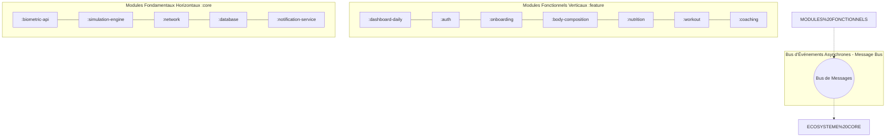

# 🌐 PulsePath Engine — Étude de Cas : Business Analysis & Architecture Fonctionnelle

Bienvenue dans le référentiel fonctionnel centralisé de **PulsePath**, une plateforme avancée de suivi de la performance métabolique et de la composition corporelle basée sur les données.

Ce dépôt rassemble l'intégralité d'une **Consolidation en Business Analysis (BA) et en Architecture Fonctionnelle**. Il modélise la manière dont un moteur métabolique traite des flux de données multi-variables—allant de la télémétrie IoT passive en arrière-plan aux annotations qualitatives subjectives de l'utilisateur—tout en garantissant une étanchéité modulaire stricte, le respect des règles métiers et l'application de garde-fous mathématiques de sécurité.

---

## 🏗️ Principes Fondamentaux de l'Architecture

Pour garantir que la solution reste évolutive, hautement maintenable et totalement indépendante des frameworks techniques, les spécifications fonctionnelles séparent strictement le système en deux couches :

1. **Les Modules Fonctionnels Verticaux (`:feature`)** : Domaines fonctionnels totalement isolés et indépendants contenant leurs propres interfaces utilisateurs (UI) et règles de gestion métiers. **Les fonctionnalités n'ont aucune visibilité directe et aucun couplage de code avec d'autres fonctionnalités.**
2. **Les Modules Fondamentaux Horizontaux (`:core`)** : Composants transversaux d'infrastructure et de calcul pur fournissant des outils, des contrats de données typés et de la tuyauterie de communication via inversion de contrôle (IoC).

---

## 🗺️ Cadre d'Intégration Pas-à-Pas (Cycle de Vie BA)

Ce projet respecte un cycle de vie rigoureux en 5 phases pour faire le pont de manière transparente entre la vision stratégique métier et les gabarits d'implémentation technique. Cliquez sur les sections ci-dessous pour accéder directement aux livrables :

### 📂 Phase 1 : Cadrage et Alignement
Définit la gouvernance, les responsabilités des parties prenantes et la gestion des risques avant le démarrage de la conception détaillée.
*   📄 **[Registre des Contributeurs](./CONTRIBUTEURS.md) :** Alignement des rôles internes (DPO, PO) et des experts cliniques externes.
*   📄 **[Feuille de Route Macro](./ROADMAP.md) :** Calendrier macro du projet, jalons fonctionnels et fenêtres de livraison (Intégration Lot 2).
*   📄 **[Registre des Risques Global](./phase-1_cadrage/REGISTRE_DES_RISQUES.md) :** Stratégies de mitigation pour les failles de sécurité, le churn utilisateur et les conflits temporels de l'interface.

### 📂 Phase 2 : Analyse Métier
Modélise les flux opérationnels de bout en bout et standardise la terminologie entre les équipes métiers et techniques.
*   📄 **[Description des Processus To-Be](./phase-2_analyse-metier/PROCESSUS_BPMN.md) :** Chorégraphies textuelles (BPMN) pour l'authentification, le parcours d'accueil et la navigation par calendrier.
*   📄 **[Glossaire Métier Centralisé](./phase-2_analyse-metier/GLOSSAIRE_METIER.md) :** Lexique unifié couvrant les concepts physiologiques (BMR, TDEE, Katch-McArdle) et les structures logiques (Navigation temporelle, Payloads d'agrégation).

### 📂 Phase 3 : Conception Fonctionnelle
Traduit les modèles opérationnels en critères d'acceptation exploitables pour le développement (User Stories) et en règles algorithmiques strictes.
*   📄 **[Architecture Fonctionnelle Spécifique](./phase-3_conception-fonctionnelle/SPECIFICATIONS_FONCTIONNELLES.md) :** Interactions inter-modules, matrice des dépendances et priorisation du Product Backlog selon la méthode MoSCoW.
*   📄 **[Règles Métiers & Formules de Calcul](./phase-3_conception-fonctionnelle/REGLES_METIERS.md) :** Spécifications des équations mathématiques (Poids lissé, index multiplicateurs d'activité, reliquat calorique dynamique `BR-DSB-02`).

#### 🗂️ Product Backlog & User Stories Détaillées (Scénarios Gherkin)
Découvrez les spécifications fonctionnelles détaillées et les contraintes d'interaction de chaque domaine :
*   🌟 **[:feature:dashboard-daily — Vue d'Ensemble & Calendrier](./phase-3_conception-fonctionnelle/user-stories/US-01_dashboard-daily.md) :** Agrégateur visuel et gestion du Mode Prévisionnel.
*   🔑 **[:feature:auth — Gestion de l'Authentification](./phase-3_conception-fonctionnelle/user-stories/US-06_authentification.md) :** Inscription, connexion sécurisée et politiques de complexité des mots de passe.
*   🚀 **[:feature:onboarding — Parcours d'Accueil en 9 Étapes](./phase-3_conception-fonctionnelle/user-stories/US-07-08_onboarding.md) :** Gestion de la navigation composite (Conteneur parent / Composants enfants).
*   📖 **[:feature:journal — Saisie Manuelle du Quotidien (Diary)](./phase-3_conception-fonctionnelle/user-stories/US-09_journal-diary.md) :** Raccourcis incrémentaux et gestion des conflits avec la télémétrie automatique.
*   ⚙️ **[:feature:profile — Informations Personnelles & Préférences](./phase-3_conception-fonctionnelle/user-stories/US-10_profil-preferences.md) :** Basculement dynamique d'unités (métrique/impérial) et portabilité (RGPD / RGPD-BE).
*   📡 **[:feature:telemetry — Collecte Passive IoT](./phase-3_conception-fonctionnelle/user-stories/US-11_telemetrie-iot.md) :** Traitement asynchrone des capteurs et seuils de préservation de la batterie.
*   ⏰ **[:feature:habits — Routines & Traqueur de Sommeil (Model 2)](./phase-3_conception-fonctionnelle/user-stories/US-15_habits-sommeil.md) :** Taux d'efficacité du sommeil et ruptures automatiques de la fenêtre de jeûne.
*   🎯 **[:feature:goals — Suivi des Objectifs de Santé](./phase-3_conception-fonctionnelle/user-stories/US-18-20_objectifs.md) :** Garde-fous des rythmes de variation métabolique et cibles d'hydratation dynamiques.
*   🍎 **[:feature:nutrition — Planificateur de Repas & Catalogue](./phase-3_conception-fonctionnelle/user-stories/US-24-25_nutrition-logs.md) :** Équilibre énergétique des aliments, calculs de portions et filtres d'exclusions (allergènes).
*   🏋️‍♂️ **[:feature:workout — Tracker d'Activités Physiques](./phase-3_conception-fonctionnelle/user-stories/US-26-27_workout-logs.md) :** Carnet de musculation (calcul de tonnage total) et estimation cardio par équivalents métaboliques (MET).
*   📈 **[:feature:analytics — Rapports Périodiques & Tendances](./phase-3_conception-fonctionnelle/user-stories/US-28-29_analytics-trends.md) :** Intégration du suivi des progrès, moyennes mobiles centrées et interpolation linéaire des oublis de saisie.
*   🏆 **[:feature:gamification — Moteur de Récompenses](./phase-3_conception-fonctionnelle/user-stories/US-30-32_gamification.md) :** Équations de progression quadratiques des niveaux (courbe d'XP), badges et plafonds anti-abus.
*   🩺 **[:feature:body-composition — Suivi de la Composition Corporelle](./phase-3_conception-fonctionnelle/user-stories/US-33-35_body-composition.md) :** Règle de cohérence arithmétique de la masse tissulaire et graphiques UI sectorisés.
*   🧠 **[:feature:coaching — Tableau de Bord du Coaching Virtuel](./phase-3_conception-fonctionnelle/user-stories/US-36-38_virtual-coaching.md) :** Structure stricte des cartes d'insights (Fact-Correlation-Action) et limites de densité UI.

#### 🛠️ Contrats et Spécifications des Modules Partagés (`:core`)
*   🧬 **[:core:biometric-api — Contrat Pivot Biométrique](./phase-3_conception-fonctionnelle/user-stories/core-contracts/CORE-BIO_biometric-api.md) :** Standardisation des types de données et interfaces de secours historiques (Failover Fallbacks).
*   🌐 **[:core:network — Intercepteur & Client Réseau Sécurisé](./phase-3_conception-fonctionnelle/user-stories/core-contracts/CORE-NET_network-client.md) :** Injection transparente de jeton Bearer, gestion automatique du rafraîchissement et relance exponentielle.
*   🔒 **[:core:database — Coffre-Fort de Persistance Locale](./phase-3_conception-fonctionnelle/user-stories/core-contracts/CORE-DB_database-vault.md) :** Chiffrement transparent des pages au repos via clé matérielle (AES-256), transactions atomiques et règles de non-destruction des schémas.
*   🔢 **[:core:simulation-engine — Moteur de Simulation Mathématique](./phase-3_conception-fonctionnelle/user-stories/core-contracts/CORE-SIM_simulation-engine.md) :** Pipeline de calcul prédictif asynchrone, modélisation non linéaire du ralentissement métabolique et détection de non-convergence.
*   📣 **[:core:notification-service — Moteur d'Acheminement des Alertes](./phase-3_conception-fonctionnelle/user-stories/core-contracts/CORE-NOT_notification-service.md) :** Anonymisation des charges utiles sur écran verrouillé (Payload Striping) et file d'attente pour le respect du sommeil (Quiet Hours).

### 📂 Phase 4 : Validation et Recette
Garantit la conformité et la robustesse de la solution face aux scénarios limites et aux conditions de pannes réelles.
*   📄 **[Cahier de Recette Fonctionnel](./phase-2_analyse-metier/PROCESSUS_BPMN.md) :** Scénarios de tests rigoureux pas-à-pas validant la navigation calendrier et l'intégrité des reliquats caloriques.
*   📄 **[Registre des Anomalies (Bug Tracker)](./phase-2_analyse-metier/PROCESSUS_BPMN.md) :** Grille de sévérité/priorité, cycle de traitement des défauts et modèle standard d'ouverture de ticket.
*   
### 📂 Phase 5 : Clôture et AccompagnementVulgarise les mécanismes fonctionnels complexes sous la forme de documents d'aide pédagogiques.
*   📄 **[Guide de Formation & Manuel Utilisateur](./phase-2_analyse-metier/PROCESSUS_BPMN.md) :** Manuels d'utilisation pour le client final (Maîtriser le Calendrier Temporel) et procédures de diagnostic pour le support technique.

🔒 Note sur la Protection des Données et la Confidentialité : L'ensemble des spécifications fonctionnelles rédigées au sein de cet espace respecte scrupuleusement les exigences réglementaires européennes (RGPD / RGPD-BE). L'architecture logicielle impose le chiffrement des données de santé en transit (TLS 1.3) et au repos (AES-256 via conteneurs matériels isolés), plaçant la sécurité de la vie privée au même niveau d'exigence que la précision mathématique des calculs.

---
